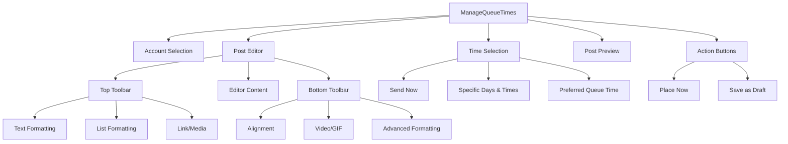
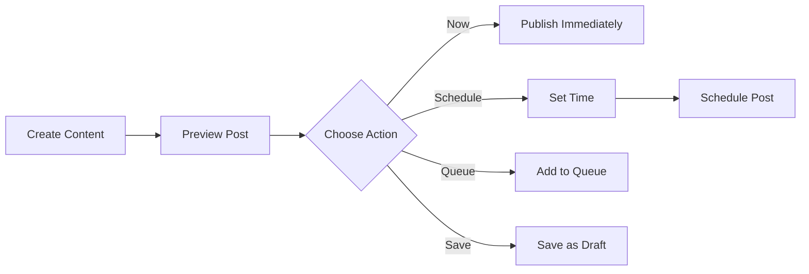
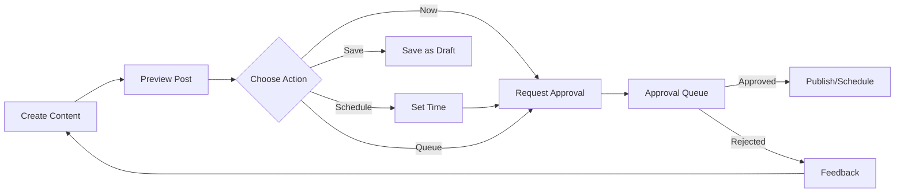
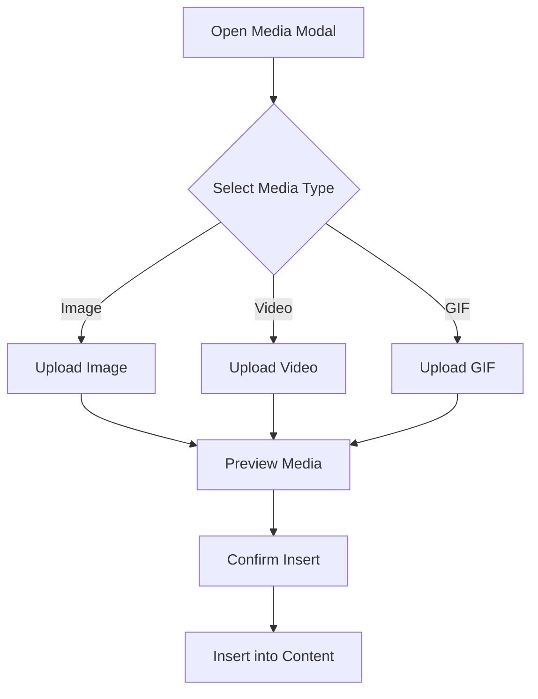

# ManageQueueTimes Page

## Overview

The ManageQueueTimes page provides content creation, preview, and publishing functionality for social media posts. Users can create, schedule, and manage posts with different publishing options based on their role permissions.

## Page Schema



## Component Hierarchy

```
ManageQueueTimes (Organism)
├── Account Dropdown (Molecule)
│   └── Account Item (Atom)
├── Editor (Organism)
│   ├── MenuBar (Molecule)
│   │   └── Format Buttons (Atom)
│   ├── EditorContent (Molecule)
│   └── BottomToolbar (Molecule)
│       └── Format Buttons (Atom)
├── MediaUploadModal (Molecule)
├── LinkModal (Molecule)
├── TimeScheduling (Molecule)
│   ├── Radio Options (Atom)
│   └── DateTime Picker (Molecule)
└── PostPreview (Molecule)
    └── Social Preview Card (Atom)
```

## Data Models

### Post Model
```typescript
interface Post {
  id: string;
  content: string;           // HTML content
  plainText: string;         // Plain text version
  createdAt: Date;
  updatedAt: Date;
  scheduledTime?: Date;      // For scheduled posts
  status: PostStatus;        // draft, pending_approval, scheduled, published
  publishType: PublishType;  // now, scheduled, queue
  authorId: string;
  accountIds: string[];      // Social accounts to publish to
  mediaAttachments: Media[];
}

type PostStatus = 'draft' | 'pending_approval' | 'scheduled' | 'published';
type PublishType = 'now' | 'scheduled' | 'queue';

interface Media {
  id: string;
  type: 'image' | 'video' | 'gif';
  url: string;
  thumbnailUrl?: string;
  size: number;
  width?: number;
  height?: number;
  createdAt: Date;
}
```

### Social Account Model
```typescript
interface SocialAccount {
  id: string;
  type: 'twitter' | 'facebook' | 'instagram' | 'linkedin';
  handle: string;
  displayName: string;
  avatarUrl: string;
  connected: boolean;
  lastSyncedAt: Date;
}
```

### User Role & Permissions
```typescript
interface User {
  id: string;
  name: string;
  email: string;
  role: UserRole;
  permissions: Permission[];
}

type UserRole = 'admin' | 'team_member';

interface Permission {
  action: 'create' | 'edit' | 'delete' | 'publish' | 'approve';
  resource: 'post' | 'account' | 'media' | 'user';
}
```

## State Management

### Component State
1. **Editor State**
   - Content (HTML)
   - Formatting
   - Media attachments

2. **Scheduling State**
   - Post type (now, specific, queue)
   - Selected dates and times (for scheduled posts)

3. **Account Selection State**
   - Selected social accounts

4. **UI State**
   - Modal visibility (media upload, link)
   - Dropdown states
   - Calendar visibility

### Application State (to be implemented)
1. **Authentication**
   - Current user
   - User permissions

2. **Social Accounts**
   - Available accounts
   - Connection status

3. **Drafts & Scheduled Posts**
   - Post status
   - Approval workflow state

## Workflows

### Publishing Workflow

#### Admin User Path


#### Team Member Path


### Media Upload Flow


## Connection Points

### Frontend Connections
1. **User Authentication**
   - Connects to the authentication system to determine user role
   - Controls publishing permissions based on role

2. **Social Accounts Integration**
   - Retrieves connected social accounts for selection
   - Shows proper preview based on selected platform

3. **Media Library**
   - Stores uploaded media
   - Retrieves media for insertion into posts

4. **Draft & Scheduled Posts Management**
   - Saves drafts for later editing
   - Manages scheduled posts queue

### External Service Integration Points (Future)
1. **Social Media API Connections**
   - Authentication and token management
   - Post publishing endpoints
   - Media upload endpoints

2. **Analytics Service**
   - Post performance tracking
   - Engagement metrics

3. **Notification System**
   - Approval requests
   - Publishing confirmations
   - Scheduled post reminders

## Technical Implementation Notes

1. **Rich Text Editor**
   - Uses TipTap editor for WYSIWYG editing
   - Custom extensions for media embedding
   - Character count limiter for platform constraints

2. **Responsive Design Considerations**
   - Desktop-first approach with mobile adaptations
   - Toolbar reorganization on smaller screens
   - Touch-friendly controls for mobile users

3. **Accessibility**
   - Keyboard navigation support
   - Screen reader compatibility
   - Proper ARIA attributes

4. **Performance Optimization**
   - Lazy-loaded modals
   - Optimized media handling
   - Debounced content updates for preview 