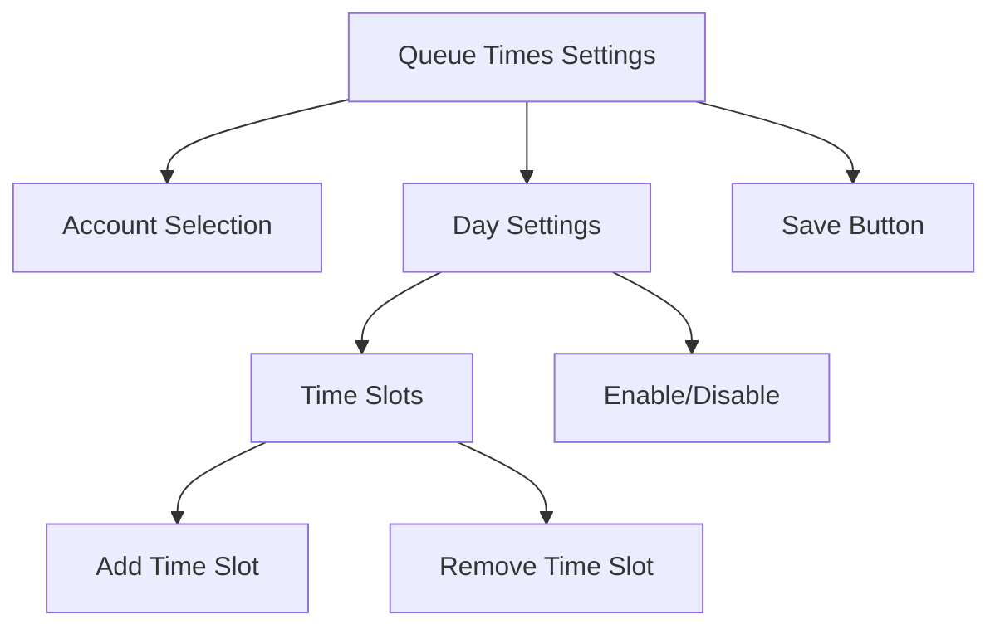
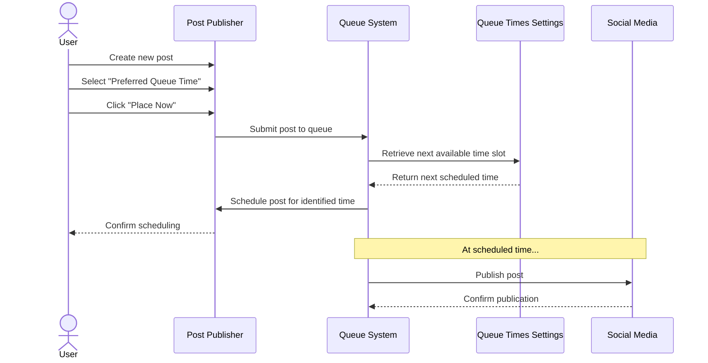

# Queue Times Settings

## Overview

The Queue Times Settings feature allows users to define preferred posting schedules for each social media account. When creating content, users can choose to add posts to a queue, which will automatically schedule them for publication at the next available time slot based on these settings.

## Feature Location
- **Settings Access**: Available in Account Settings under the "Set Queue Times" tab
- **Publishing Integration**: Used when creating posts with the "Preferred Queue Time" option

## Key Functionality

### Account-Specific Queue Settings
Each social media account can have its own unique queue scheduling configuration, allowing for platform-specific posting strategies.

### Day-by-Week Configuration
- Enable/disable posting for specific days of the week
- Set multiple preferred posting times per day
- Add, remove, or modify time slots as needed

### Queue Scheduling Logic
When a post is added to the queue:
1. The system finds the next available time slot based on the current time
2. If no slots are available on the current day, it looks at the next enabled day
3. The post is automatically scheduled for that time slot
4. If multiple posts are queued, they are assigned sequentially to upcoming slots

## User Interface

### Queue Times Settings Screen


### Component Hierarchy
```
Queue Times Settings
├── Account Dropdown (Molecule)
├── Weekday Settings (Organism)
│   ├── Day Toggle (Molecule)
│   │   └── Toggle Switch (Atom)
│   └── Time Slots (Molecule)
│       ├── Time Input (Atom)
│       ├── Remove Button (Atom)
│       └── Add Slot Button (Atom)
└── Save Settings Button (Atom)
```

## Post Creation Integration

When creating a new post in the ManageQueueTimes page, users have three scheduling options:
1. **Send Now**: Publish immediately
2. **Specific Date & Time**: Select a custom date and time
3. **Preferred Queue Time**: Add to the queue system

### Workflow


## Technical Implementation

### Queue Settings Data Model
```typescript
interface TimeSlot {
  id: string;
  time: string; // 24-hour format "HH:MM"
}

interface WeekdaySetting {
  day: string;
  enabled: boolean;
  timeSlots: TimeSlot[];
}

interface QueueSettings {
  accountId: string;
  weekdaySettings: WeekdaySetting[];
}
```

### API Integration
- `GET /api/queue-settings?accountId=XYZ`: Retrieve queue settings for a specific account
- `PUT /api/queue-settings`: Update queue settings for an account

### Queue Processing Logic
When a post is added to the queue, the system:
1. Gets the current date and time
2. Checks current day's queue time settings for the selected account(s)
3. Finds the next available time slot after the current time
4. If no slots are available today or all are in the past, moves to the next enabled day
5. Schedules the post for publication at the identified time slot

## Best Practices

### Queue Time Strategy
- **Peak Engagement Times**: Set queue times based on audience analytics
- **Content Distribution**: Space out posts evenly throughout the day
- **Cross-Platform Coordination**: Stagger times across platforms to avoid overwhelming followers with simultaneous posts
- **Time Zone Considerations**: Account for audience time zones when setting queue times

### Multiple Account Management
- Configure distinct queue times for each platform
- Consider platform-specific best practices (e.g., more frequent posting on Twitter vs. LinkedIn)
- Use the account selection dropdown to quickly switch between account settings

## Limitations and Considerations
- Once a post is scheduled through the queue system, it follows the regular scheduled post workflow
- If all queue slots for the coming week are filled, additional posts will be scheduled for the following week
- Modifying queue time settings does not affect posts that have already been scheduled
- Queue settings are account-specific, not user-specific 