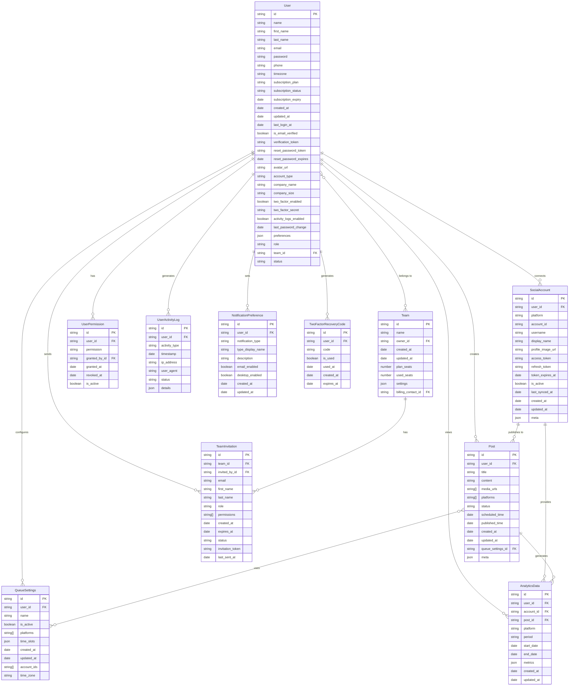

# Marketing Automation Tool - Entity Relationship Diagram

## Legend

- **PK**: Primary Key
- **FK**: Foreign Key
- **||--o{**: One-to-many relationship
- **}o--o{**: Many-to-many relationship

## Relationship Descriptions

1. **User to SocialAccount**: One user can connect many social accounts
2. **User to Post**: One user can create many posts
3. **User to QueueSettings**: One user can configure many queue settings
4. **User to Team**: Many users can belong to one team, and a user may be a team owner
5. **User to TeamInvitation**: One user can send many team invitations
6. **SocialAccount to Post**: One social account can have many posts published to it
7. **Post to QueueSettings**: Many posts can use the same queue settings
8. **SocialAccount to AnalyticsData**: One social account can generate many analytics records
9. **Post to AnalyticsData**: One post can generate many analytics records 