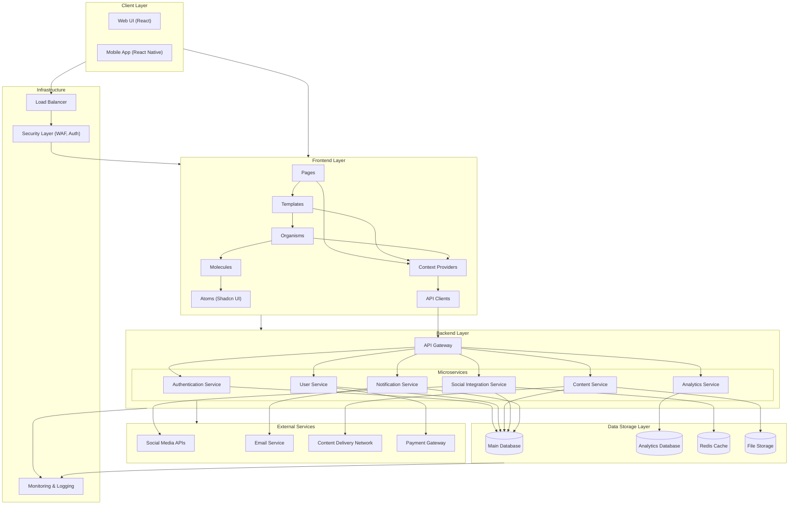

# Marketing Automation Tool - System Architecture Diagram

## Architecture Components

### Client Layer
- **Web UI**: React-based web application using TypeScript
- **Mobile App**: React Native application for iOS and Android

### Frontend Layer
- **Pages**: Top-level page components (Dashboard, Connect, Publish, etc.)
- **Templates**: Page layout templates following atomic design
- **Organisms**: Complex UI sections (forms, data tables, navigation)
- **Molecules**: Simple component combinations
- **Atoms**: Basic UI components using Shadcn UI
- **Context Providers**: State management using React Context API
- **API Clients**: Service modules for API communication

### Backend Layer
- **API Gateway**: Entry point for all API requests with routing and rate limiting
- **Microservices**:
  - **Authentication Service**: User authentication and authorization
  - **User Service**: User profile and team management
  - **Content Service**: Content creation, scheduling, and publishing
  - **Analytics Service**: Data collection and reporting
  - **Social Integration Service**: Social platform connectivity
  - **Notification Service**: Email and in-app notifications

### Data Storage Layer
- **Main Database**: Primary relational database for application data
- **Analytics Database**: Optimized for analytical queries
- **Redis Cache**: In-memory caching for performance
- **File Storage**: Binary storage for media files

### External Services
- **Social Media APIs**: Integration with various social platforms
- **Email Service**: Transactional email delivery
- **CDN**: Content delivery network for media assets
- **Payment Gateway**: Subscription and billing management

### Infrastructure
- **Load Balancer**: Distributes traffic across application instances
- **Security Layer**: Web Application Firewall and authentication services
- **Monitoring & Logging**: System monitoring, error tracking, and analytics

## Data Flow

1. **Client Request Flow**:
   - Client makes request → Load Balancer → Security Layer → Frontend → API Clients → API Gateway → Microservices

2. **Authentication Flow**:
   - Login request → Auth Service validates credentials → JWT token returned to client → Subsequent requests include token

3. **Content Publishing Flow**:
   - User creates post → Content Service stores draft → When scheduled, retrieves post → Social Service publishes to platforms → Analytics Service tracks performance

4. **Analytics Collection Flow**:
   - Social Service periodically fetches data from social platforms → Processes and stores in Analytics Database → User requests reports → Analytics Service generates visualizations 